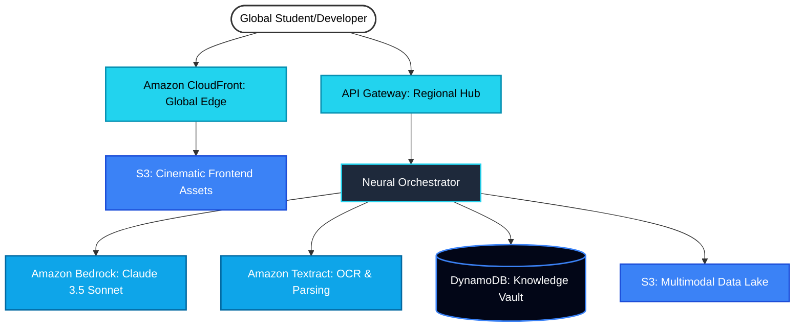

# 🚀 The Ghostwriter: AWS-Powered Solution Breakdown

## 💡 Brief about the Idea
**The Ghostwriter** is a premium, AWS-native intelligence engine designed to convert the "high-entropy noise" of modern academic and professional life into "Structured Wisdom." By orchestrating **Amazon Bedrock (Claude 3.5 Sonnet)**, **Amazon Textract**, and **AWS Lambda**, it creates a seamless pipeline that ingests multimodal content (lecture audio, video, and dense documentation) and synthesizes high-fidelity study guides, visual logic flows, and predictive exam insights—all delivered through a cinematic, zero-latency global edge interface.

## ✨ Features Offered by the Solution

### 1. Neural Multimodal Ingestion
Combine raw data from disparate sources (PDFs, PPTX, MP3, MP4) into a unified intelligence context using **Amazon Textract** and **Bedrock Multimodal Processing**.

### 2. Logic Flow Synthesis (Visual Representation)
Decompile technical complexity into interactive **Mermaid.js** diagrams, allowing users to "see" the architecture of knowledge.

### 3. Predictive Exam Intelligence
A multi-agent autonomous stack that analyzes content to assign probability scores to specific topics, simulating realistic assessment patterns.

### 4. High-Fidelity Active Recall Hub
Instant generation of **Smart Flashcards** grounded strictly in source material to ensure zero hallucinations and maximum retention.

### 5. Cinematic Global Edge Experience
A premium, 3D-animated interface delivered via **Amazon CloudFront**, ensuring a frictionless study experience regardless of global location.

### 🏗️ Visual Architecture Representation

### 🔄 Solution Process Flow

```mermaid
graph LR
    %% Steps
    A[Raw Input: Docs/Media] -->|Upload| B(S3 Multimodal Data Lake)
    B -->|Trigger| C{Lambda Neural Orchestrator}
    C -->|Extract Signals| D[Amazon Textract / OCR]
    D -->|Refined Context| E[Amazon Bedrock: Synthesis]
    E -->|Generate Structure| F{Structured Wisdom}
    
    F --> G[Master Guides]
    F --> H[Mermaid Diagrams]
    F --> I[Active Recall Cards]
    
    G & H & I -->|Global Edge Cache| J([End User Terminal])

    %% Styling
    style A fill:#fff,stroke:#333,stroke-width:2px,color:#000
    style B fill:#3b82f6,stroke:#1d4ed8,stroke-width:2px,color:#fff
    style C fill:#1e293b,stroke:#22d3ee,stroke-width:2px,color:#fff
    style D fill:#0ea5e9,stroke:#0369a1,stroke-width:2px,color:#fff
    style E fill:#0ea5e9,stroke:#0369a1,stroke-width:2px,color:#fff
    style F fill:#22d3ee,stroke:#0891b2,stroke-width:2px,color:#000
    style G fill:#020617,stroke:#3b82f6,stroke-width:2px,color:#fff
    style H fill:#020617,stroke:#3b82f6,stroke-width:2px,color:#fff
    style I fill:#020617,stroke:#3b82f6,stroke-width:2px,color:#fff
    style J fill:#ffffff,stroke:#333,stroke-width:2px,color:#000
```

## 🖼️ Solution Wireframes & Mockups

The following high-fidelity mockups represent the **Academic Ghostwriter** user experience. The design adheres to a "Cinematic Mono-Cyan" aesthetic, combining dark-mode depth with high-contrast intelligence markers.

### 1. Cinematic Landing Page
The entry point features a central 3D **Neural Core** and bento-grid modules that introduce the platform's core capabilities. It sets a premium tone for the intelligence terminal experience.

### 2. Neural Hub Dashboard
A kinetic bento-grid interface where users manage their knowledge clusters. It features embedded **Logic Flow Diagrams** (Mermaid.js) and active-recall **Smart Flashcards** with neon-glow highlights.

### 3. Neural Synthesis Engine
The real-time synthesis view where raw data is converted into structured wisdom. It features a "Typewriter" streaming effect, technical telemetry overlays, and a pulsing central engine that reacts to processing intensity.

## 1. How different is it from any other existing ideas?
Most AI study tools are "Tabular Summarizers"—simple wrappers around basic LLMs that provide static bullet points. **The Ghostwriter** is an AWS-native intelligence engine:

- **AWS Multimodal Synthesis**: Leveraging **Amazon Bedrock**, we don't just process text; we ingest the **entire classroom atmosphere**. By combining **Amazon Textract** for high-precision document parsing with Bedrock’s multimodal capabilities, we synthesize lecture audio, video presentations, and dense PDFs into a singular wisdom graph.
- **Architectural Deconstruction**: Instead of simple summarization, we decompile complex technical logic into **Mermaid.js visual maps**. We leverage the computational power of **AWS Lambda** to perform real-time logical deconstruction that turns "Raw Input" into "Visual Logic Flows."
- **Global Edge UX**: Unlike tools delivered via regional servers, we use **Amazon CloudFront** to serve a cinematic **Brutalist-Glass** interface from global edge locations, ensuring zero latency and a high-fidelity experience that makes studying feel like a premium command-center activity.

## 2. How will it be able to solve the problem?
Students and developers today face **"Infinite Information Entropy"**—massive amounts of unstructured data stored in silos.

**The Ghostwriter solves this through an AWS-backed pipeline:**
- **Amazon Textract Signal Extraction**: We use high-fidelity OCR to scan for "Exam Signals" (formulas, emphasis markers, and conceptual anchors) that standard summaries miss.
- **Bedrock-Powered Reasoning**: Using **Claude 3.5 Sonnet on Amazon Bedrock**, we close the "Retention Gap" by instantly generating active-recall Flashcards grounded strictly in the source material to eliminate hallucinations.
- **Predictive Intelligence Agent**: Our **Exam Predictor** uses a multi-agent stack running on serverless infrastructure to simulate professor patterns, helping users focus on the 20% of content that matters most.

## 3. USP (Unique Selling Proposition)
> **"High-Fidelity Neural Synthesis powered by the AWS Global Intelligence Stack."**

- **Bedrock Foundation Reasoning**: Access to the world's most powerful reasoning models (Claude 3.5 Sonnet) with the security and scale of the AWS cloud.
- **Worldwide Sub-Millisecond Delivery**: A globally distributed architecture using **CloudFront** and **S3** that ensures the "Ghostwriter Engine" is as fast in Delhi as it is in New York.
- **Serverless Resilience**: A 100% serverless architecture (Lambda, DynamoDB) that scales instantly to millions of users while maintaining a premium, frictionless 3D cinematic aesthetic.

## 🌟 Potential Impact

### 🌍 Social Impact
- **Democratizing High-End Intelligence**: By leveraging the **AWS Global Infrastructure**, "The Ghostwriter" brings elite-level neural synthesis to students in remote regions. It bridges the educational divide by delivering state-of-the-art tools with sub-millisecond latency via **CloudFront**, ensuring that a student in a rural area has the same technical advantage as one in a major tech hub.
- **Cognitive Accessibility**: Our AI grounded in **Amazon Bedrock** ensures that complex, technical documentation is transformed into inclusive, structured wisdom, assisting learners with different cognitive styles and reducing the barrier to entry for high-level technical literacy.

### 📈 Economic Impact
- **Developer Throughput & ROI**: For organizations, the tool drastically reduces the "Time to Context" for new developers. By using **AWS Serverless (Lambda)**, we provide an ultra-efficient synthesis pipeline that saves thousands of man-hours in document review, directly increasing economic productivity and ROI on technical training.
- **Serverless Cost-Efficiency**: The **100% Serverless architecture** ensures that the solution remains economically viable at scale. There is zero overhead for idle resources, allowing us to pass the cost savings to the users while maintaining the ability to scale to millions of concurrent sessions during peak exam or development cycles.
